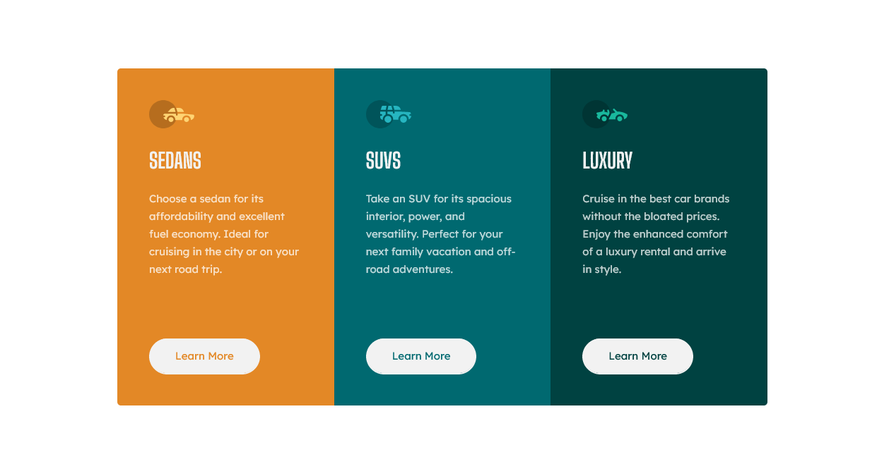

## Table of contents

- [Overview](#overview)
  - [The challenge](#the-challenge)
  - [Screenshot](#screenshot)
  - [Links](#links)
- [My process](#my-process)
  - [Built with](#built-with)
- [Author](#author)
- [Acknowledgments](#acknowledgments)

## Overview

### The challenge

Users should be able to:

- View the optimal layout depending on their device's screen size
- See hover states for interactive elements

### Screenshot

### Links

- Solution URL: [Solution](https://www.frontendmentor.io/solutions/responsive-card-component-using-grid-html-css-OdVYIPbY5)
- Live Site URL: [Live Site](https://jolly-turing-6e4b13.netlify.app/)

## My process

### Built with

- CSS custom properties
- CSS Grid
- Mobile-first workflow

## Author

- LinkedIn - [Charmaine Lee](https://www.linkedin.com/in/charmainelee-huimin/)
- Frontend Mentor - [@charmainelhm](https://www.frontendmentor.io/profile/charmainelhm)

## Acknowledgments

Practice is a very important learning stage in coding, and I want to thank Frontend Mentor(https://www.frontendmentor.io/) for making it easier for me to do that. With their help, I can focus on understanding the different properties in HTML and CSS with my minimal knowledge on UI and UX design.
